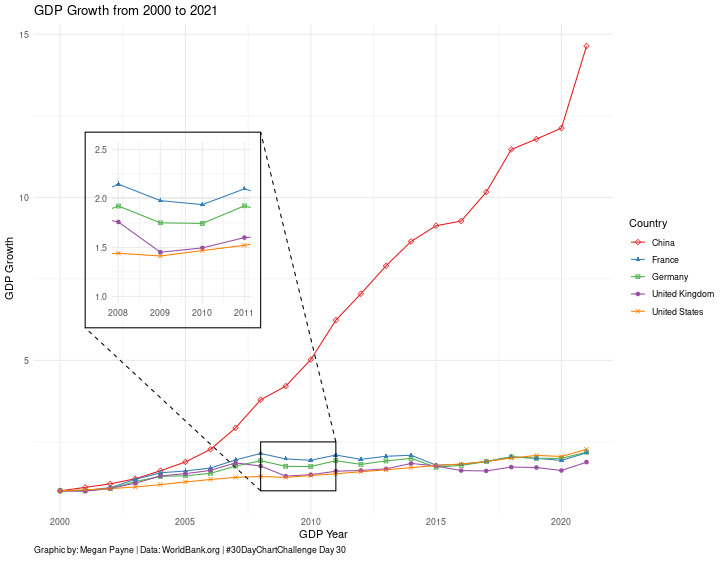

# 30 Day Chart Challenge

In the month of April, there is a chart prompt for every day. This has been fun, so 
I will continue this next year with the 2024 Chart Challenge. Until then, here is the 
code for 2023 - Day 29 and 30. 

## 2023 Chart challenge 

Code files in the [2023_challenge folder](2023_challenge)

Day 29 - Monocrome [Code](2023_challenge/image_hist_day29.py) 

Day 30 - WorldBank [Code](2023_challenge/worldbank_day30.R)

https://twitter.com/30DayChartChall/status/1632767770239664134

